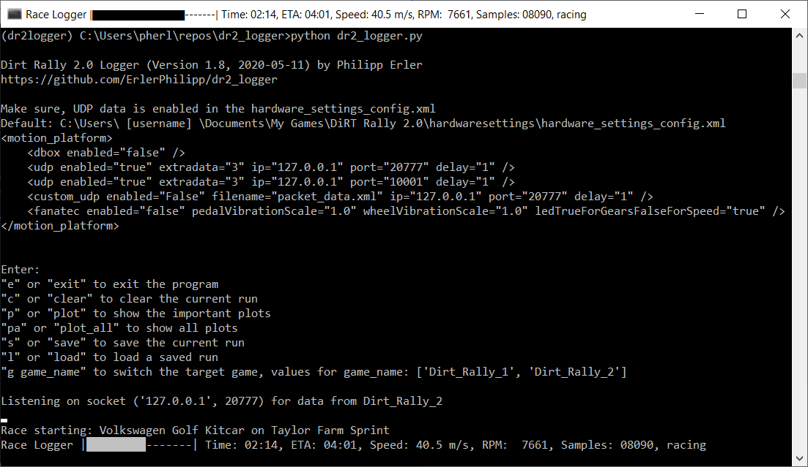
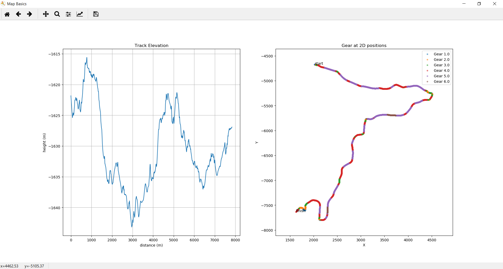
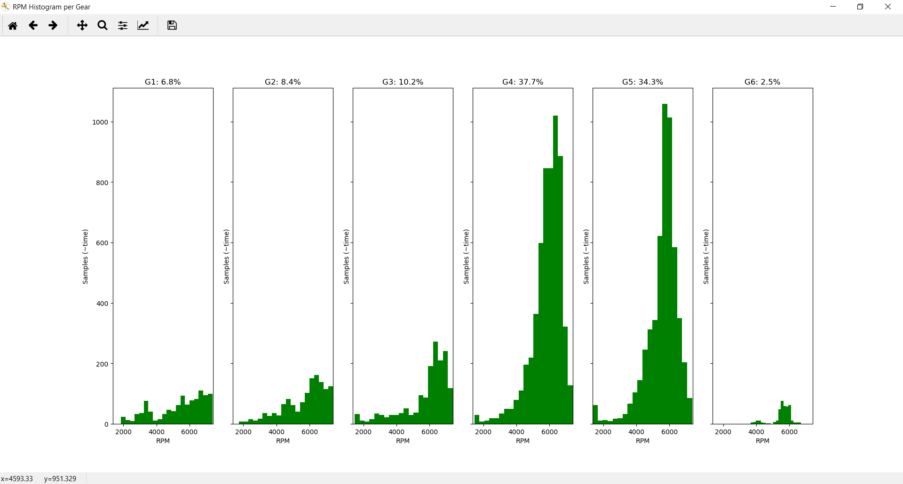
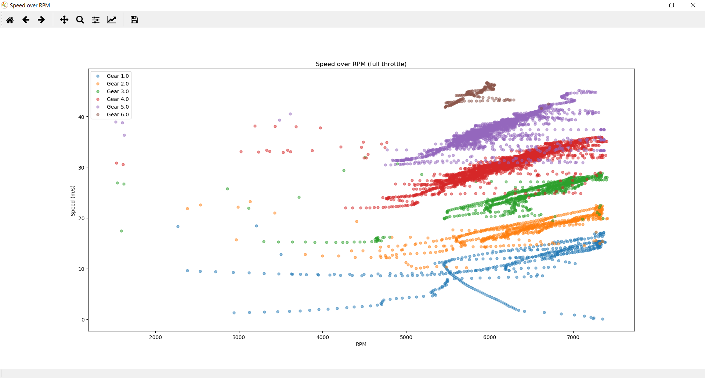
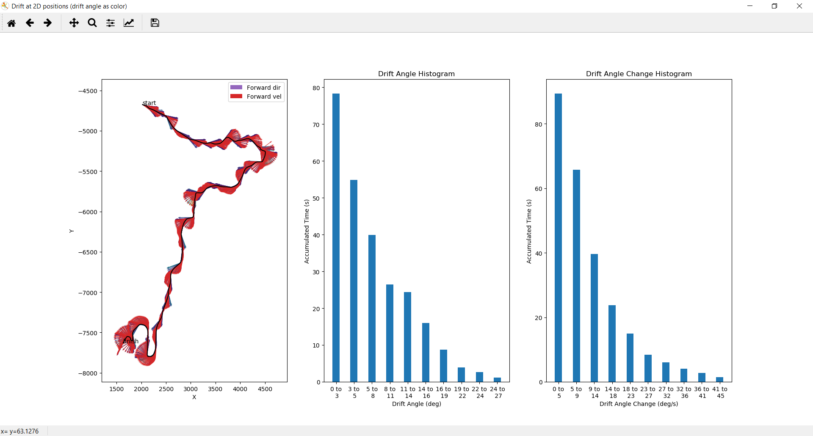
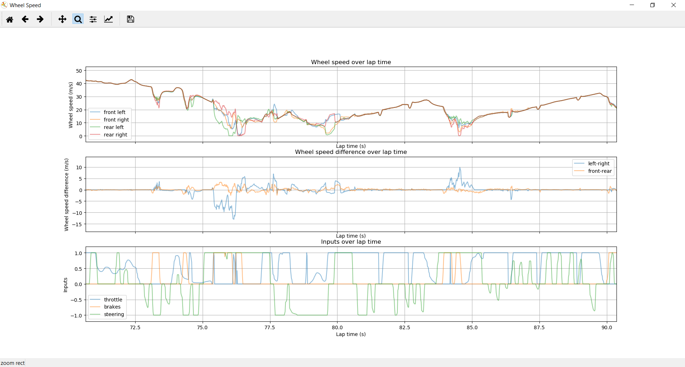
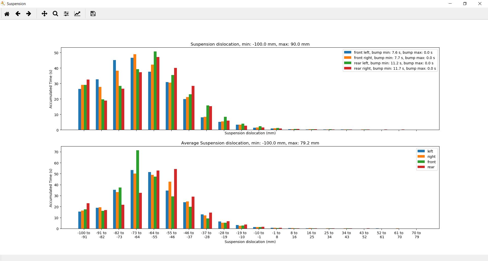
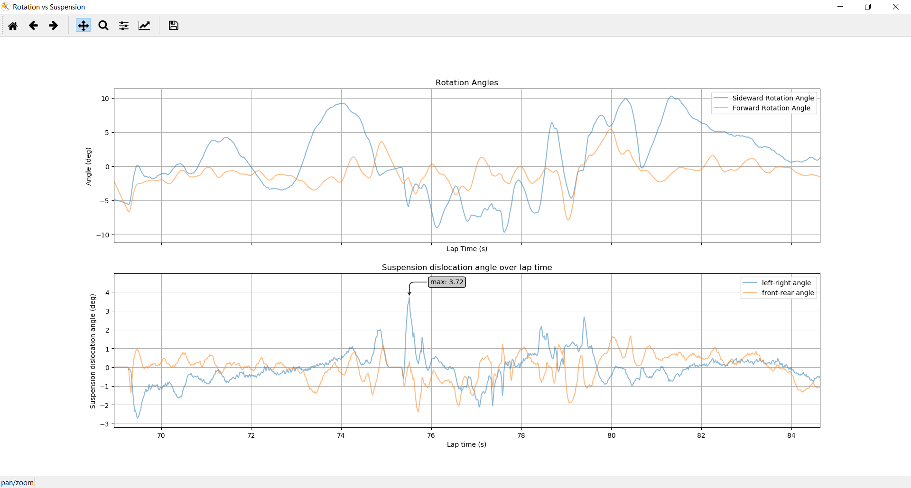

# Dirt Rally 2.0 Logger #

Dirt Rally 2.0 Logger is a logging and analysis tool for car setups in Dirt Rally 2.0 by Codemasters. 
This is a free and open-source tool written by Philipp Erler in 2019.

- [Download Executable (Version 1.3, 2019-09-02)](https://philipperler.net/dr2logger1_3/)
- [Source Code, Documentation and Support](https://github.com/ErlerPhilipp/dr2_logger)

## How to Use ##

1. Enable UDP data for Dirt Rally 2.0
    1. Open the hardware_settings_config.xml (by default in "C:\Users\ [username] \Documents\My Games\DiRT Rally 2.0\hardwaresettings\hardware_settings_config.xml")
    1. Set udp enabled="true"
    1. Set extra_data=3 to get all information
    1. Set ip="127.0.0.1" to keep the information on localhost
    1. Set port=20777 (you would need to change the port in the dr2logger every time otherwise)
    1. Set delay="1" so that DR2 ends the current car state at 100 FPS (important for derived values)
    1. Example:
        ```xml
        <motion_platform>
            <dbox enabled="false" />
            <udp enabled="True" extradata="2" ip="127.0.0.1" port="20777" delay="1" />
            <custom_udp enabled="false" filename="packet_data.xml" ip="127.0.0.1" port="20777" delay="1" />
            <fanatec enabled="false" pedalVibrationScale="1.0" wheelVibrationScale="1.0" ledTrueForGearsFalseForSpeed="true" />
        </motion_platform>
        ```
1. Download and unzip dr2logger.zip archive
1. Run the dr2logger.exe while you play DR2
1. After each race, switch to the logger to save the log and see the plots
1. Remarks:
    1. Disable any another running telemetry tools. This is necessary because data is sent only once from DR2 but removed from the port when a program reads a package. There can't be any guarantee that one progam receives all packages.
    1. Don't save, load or analyze your run while the race is running. Otherwise, data might get lost. Pausing the race is sufficient.
    1. This will probably work with other racing games by Codemaster, for example Dirt Rally 1 and Dirt 4. Those games use the same datastructure for the UDP packages. However, I didn't test it. Other racing games with UDP output, such as Project Cars, will require trivial changes in this tool's networking code.


You should see this amazing command-line window.

## How to Evaluate ##

Let's see how to use this tool to analyze your car setups. This is an example with the Mitsubishi Lancer Evo VI on a Polish track. We can analyze how the car reacts to the high speeds, mixed road and irregular surface. I'll explain what kind of information you can pull from the plots and how you can improve certain aspects of the setup.

### Track Information ###



This plot gives some basic information about the track such as elevation, route and used gear.

### Gears ###



This plot shows how much time you spent in which gear at which RPM. I spent most time in gear 4 and 5 while the other gears are hardly used. The lower three gears should be set much longer while the higher three gears should be somewhat shorter.



This plot shows the speed at varying RPM. The blue series of points in the lower right corner is the acceleration from the start line. The traction is too low, therefore the wheels are spinning without really pushing the car. The slope of the different point groups varies with the gears. This might be wanted but can also be a hint that the gear ranges are off. The RPM histograms back the hint in this case.

### Wheel Speeds and Differential ###



In this plot, you can see the forward direction of the car and its movement direction. The more these vectors disagree, the more your car is drifting. The histogram in the middle shows how often you drifted how much while the right histogram shows how fast the drift angle changed. The Evo VI is a rather easy to control car. The histograms tell that the drift angle was mostly below 20 degree. The angular velocity was also mostly below 20 degrees per second and therefore quite controlled. This supports the claim that the car can be controlled with the current setup. 



This plot shows the wheel speeds. While the topmost graph is about individual wheels, the middle plot compares sides of the car. As an example, one line is the average of the left wheels minus the average of the right wheels. The graph at the bottom shows the inputs, i.e. throttle, brakes and steering. Make sure to use the magnifying glass to zoom into the plots. This plot is rather hard to interpret but you should still be able to find hints of bad setups. The four wheels have approximately the same speed most of the time. Only strong steering accompanied with throttle or brakes make a significant difference. So, the setup is probably ok. This is again a hint that the Evo VI is rather easy to handle. 

Let's analyze the 'bubble' in the middle of the upper graph in more detail. Here, the front-left and rear-right wheels were considerably faster than the other wheels. It seems that the differential took action here. While one wheel of each axis accelerated, the other wheel decelerated. Probably, the surface was bumpy here. The decelerated wheels are unfortunately the ones that have contact to the road. Therefore, you might want to set the differential stronger to be faster in such situations. Also, there is a sudden change in steering direction together with sudden full throttle. This weight transfer combined with bumps is not handled nicely by the suspension. The next two plots give more insight into such issues.

### Suspension ###



This plot shows the suspension dislocation of individual wheels and compares sides of the car. A negative dislocation means that the spring is compressed. Quite often, the springs were fully compressed at -100 mm. Since there is no information transmitted from DR2, we can only assume that the bump stops were hit at this dislocation. Hitting the bump stops is very bad for the stability and can cause crashes. If you see such a behavior, you should definitely increase the ride height. If it's already at the limit, you can still stiffen the springs and damping. Better a harder suspension than hitting the bump stops.

The lower graph displays the averaged front/back and left/right statistics. You can see that the rear springs are more often fully compressed. Therefore, you should probably stiffen the rear springs or dampers.



This last plot (for now) compares spring dislocation with car roll and pitch. With a good suspension, the car should be almost unaffected by surface irregularities. However, when the terrain is too rough, e.g. with camber, the car must tilt to the side. Similarly, driving over bumps shouldn't throw the car around but slopes and jumps of course rotate the car around its pitch axis.

The suspension angles are approximated for the width and length of the Audi Quattro S1. So, the absolute values of the suspension rotation graph will be off for other cars. But we care mostly for the relation between both graphs, anyway.

In the upper graph with the car rotations, we can see that the lines have much lower frequencies than the middle graph with the suspension angles, as it should be. Looking at the center of the car rotation graph (upper graph),we see that the car rotates quickly backwards because the springs (middle graph) could not compensate the pressure anymore since they were already fully compressed (lower graph). This was probably the landing after a longer jump.

## Raw Data ##

I can only use the information I get from Dirt Rally 2.0 via UDP. This is Currently:

1. run time (starts after loading screen)
1. lap time (starts after countdown)
1. distance (driven distance)
1. progress (0.0..1.0)
1. car position (3D vector in world space)
1. forward speed (m/s as shown in HUD)
1. car velocity (3D vector in world space)
1. roll (3D vector in world space)
1. pitch (3D vector in world space)
1. suspension dislocation per wheel (mm)
1. suspension dislocation change per wheel (mm/s)
1. wheel speed per wheel (m/s)
1. throttle (0.0..1.0)
1. steering (-1.0..+1.0)
1. brakes (0.0..1.0)
1. clutch (0.0..1.0)
1. gear (-1,0,1..n)
1. g-force (lat-lon)
1. current lap
1. RPM of engine
1. [more stuff, mostly originating from F1 2016](https://docs.google.com/spreadsheets/d/1eA518KHFowYw7tSMa-NxIFYpiWe5JXgVVQ_IMs7BVW0/edit?usp=drivesdk)

See [networking.py](./networking.py) for more information.

## How to Build ##

1. Download the code and unzip or pull the repository
1. If you don't have it already, install a Python 3, e.g. Anaconda with Python 3.7
1. If using Anaconda, you should probably create a new environment for this project
1. Use conda or pip to install the required packages:
    1. numpy
    1. scipy
    1. keyboard
    1. tk
    1. basemap
1. Build and run main.py with Python

## Open Issues and Contributing ##

Please, feel free to send pull requests when you have improvements for the code and documentation.

So far, I had no idea how to visualize and analyze cornering. Should the car change its direction faster? How much speed is lost in the process? How does e.g. toe and camber angle affect the acceleration and speed on straights? I think, you probably have a good feeling for the required steering and the overall performance can be measured simply with the race time. In contrast, you can hardly have a feeling for optimal gear and suspension setting. So, I focused more on these things. Anyway, if you have suggestions for missing plots, for improving plots and for more derived information, please tell me (in the project forum).

On the long run, comparing two or more recordings would be great. However, this is not trivial because most plots would need a common registration. Using the run time won't work. Using the progress could work but would make time-dependent data hard to understand or even useless.

## License ##

All parts of this project are published under the permissive [MIT license](./LICENSE). In short, you can do with the code, documentation, images and so on whatever you want. But don't complain if it doesn't work as expected.

If you share (parts of) the dirt rally 2 logger, I'd be happy if you mention or link my work. If you find this tool useful, please drop me a message. This would make me feel good :)

## Change Log ##

- 1.3 (2019-09-02): keyboard I/O is now in a separate thread, current state in window title
- 1.2 (2019-08-25): better histograms, error handling for sockets
- 1.1 (2019-08-19): improved plots for suspension and rot vs susp
- 1.0 (2019-08-17): initial release
