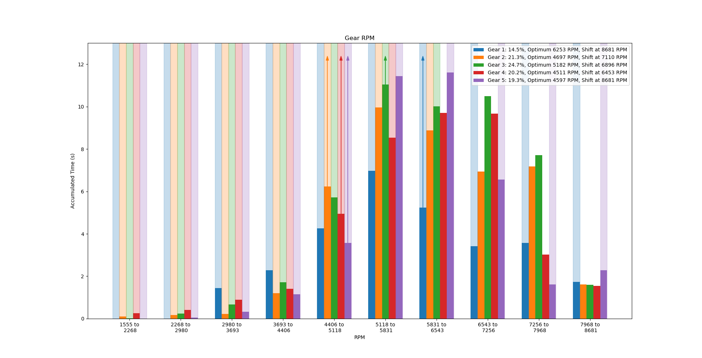

# Dirt Rally 2.0 Logger #

Dirt Rally 2.0 Logger is a logging and analysis tool for car setups in [Dirt Rally 1 and 2 by Codemasters](https://dirtrally2.com/). 
This is a free and open-source software.

[Get the executables, source code, documentation and support on Github.](https://github.com/ErlerPhilipp/dr2_logger)

## How to Use ##

Don't forget to enable UDP in the "hardware_settings_config.xml" and set the same port for the game and tool. Otherwise, simply extract the tool's zip and run the exe. For detailed instructions see the [setup guide](docs/setup.md).

This Logger is mostly a command-line tool where you can see the available commands and current race progress. It looks like this:

You can get plots of a race's statistics like this one:

## Usage ##

Here is more information about how to use this tool:
- [Plots](docs/plots_description.md)
- [Example: Optimizing the setup of the Renault 5 Turbo for Noorinbee Ridge Descent, Australia.](docs/example.md)
- [General tuning guide](docs/tuning_guide.md)

## Details ##

You may see 'unknown car' or 'unknown track' in your logs. This happens when the internal database is outdated. In this case, please fill in the car names in the 'unknown cars.txt' and 'unknown tracks.txt' that you should find in the logger's directory. Then send the contents of those files to me.
Due to ambiguous data (exactly the same idle/max RPM and number of gears), the following cars in DR2 cannot be distinguished:
- Lancia Delta S4 RX, non-RX and Peugeot 208 R2
- Peugeot 205 T16 RX and non-RX
- Audi S1 EKS RX Quattro Supercars (2019) and Volkswagen Polo R Supercar
- Peugeot 208 WRX Supercars (2019) and Renault Clio R.S. RX
- Renault Megane R.S. RX (2019) and Subaru Impreza WRX STI NR4 and Fiat 131 Abarth Rally 
- Ford Fiesta RXS Evo 5 and Ford Fiesta RX (Stard)
- Ford Focus RS Rally 2001 and Seat Ibiza RX
- Mitsubishi Lancer Evo VI and BMW M2 Competition
- Mitsubishi Lancer Evo X and Peugeot 208 T16
- Skoda Fabia Rally and Subaru WRX STI RX
- Skoda Fabia R5 and Volkswagen Polo GTI R5

[Here are more details for developers covering how to run the Python code directly, how to build an executable and which information is available.](docs/implementation.md)

## License ##

All parts of this project are published under the permissive [MIT license](./LICENSE). In short, you can do with the code, documentation, images and etc. on whatever you want. I hold no responsibility if it doesn't work as expected.

When you share (parts of) this repository, please mention or link my work. If you find this tool useful, I encourage you to leave some feedback, e.g. as an issue.

## Change Log ##

- 1.8.2 (2020-10-03):
    - Add guidelines for tuning.
    - Fix some crashes.
    - Add continuous integration.
    - Add new Ford Ibiza R5 MKII.
- 1.8.1 (2020-05-15):
    - Prevent several crashes and other bugfixes.
    - Add country code and region to track names.
    - Improved optimal RPM detection.
    - Improved wheel-in-air detection.
- 1.8 (2020-05-11):
    - Added support for Dirt Rally 1.
    - Mayor re-structuring to allow for different games in one logger.
    - Added setting for the target game, switch via command 'g Dirt_Rally_1'.
    - Many improvements for plots.
    - Added estimation of optimum RPM.
    - Improved ground-contact detection.
- 1.7 (2020-03-25):
    - Added cars and tracks for the Flat Out Pack.
    - Added (experimental) ground-contact detection.
    - Added (experimental) energy and power plots.
    - Simplified game-state detection.
- 1.6 (2019-10-14):
    - Added automatic car and track detection.
    - Improved automatic race detection.
- 1.5 (2019-10-01): 
    - Improved the automatic detection of races.
    - Input and output IPs and ports can now be changed in the 'settings.ini'.
    - You can now change the path for automatic session saves.
    - The logger can now forward received UDP packages to another socket. This way, you can use the logger and telemetry tools at the same time.
- 1.4 (2019-09-07): 
    - Added automatic detection and saving of runs.
    - Prevent a crash caused by not enough data for plots.
- 1.3 (2019-09-02): 
    - Keyboard I/O is now in a separate thread.
    - The current state is now printed in the window title.
- 1.2 (2019-08-25): 
    - Improved histograms.
    - Added error handling for sockets.
- 1.1 (2019-08-19): Improved plots for suspension and rot vs susp.
- 1.0 (2019-08-17): Initial release.

## Older Releases ##

- [Executable (Version 1.8.1, 2020-05-15)](https://philipperler.net/dr2_logger_1_8_1/)
- [Executable (Version 1.8, 2020-05-11)](https://philipperler.net/dr2_logger_1_8/)
- [Executable (Version 1.7, 2020-03-25)](https://philipperler.net/dr2logger_1_7/)
- [Executable (Version 1.6, 2019-10-14)](https://philipperler.net/dr2logger_1_6/)
- [Executable (Version 1.5, 2019-10-01)](https://philipperler.net/dr2logger_1_5/)
- [Executable (Version 1.4, 2019-09-14)](https://philipperler.net/dr2logger_1_4/)
- [Executable (Version 1.3, 2019-09-02)](https://philipperler.net/dr2logger_1_3/)
- [Executable (Version 1.2, 2019-08-25)](https://philipperler.net/dr2logger_1_2/)
- [Executable (Version 1.1, 2019-08-19)](https://philipperler.net/dr2logger_1_1/)
- [Executable (Version 1.0, 2019-08-17)](https://philipperler.net/dr2logger_1_0/)

## Related Tools ##

Aside from this tool, which focuses on the analysis and visualization of single runs, there are other tools.

[Dirt Rally Time Recorder](https://github.com/soong-construction/dirt-rally-time-recorder):
This tool allows you to track your stage times in DiRT Rally and browse them, which the game itself does not allow.

[RaceTrack Data Acquisition](https://www.racedepartment.com/downloads/racetrack-data-acquisition-rda.26829/):
RDA is an application that can log telemetry from DiRT Rally and DiRT Rally 2.0 to CSV, BIN, or MoTeC LD files.
It includes an overlay window with delta times.

