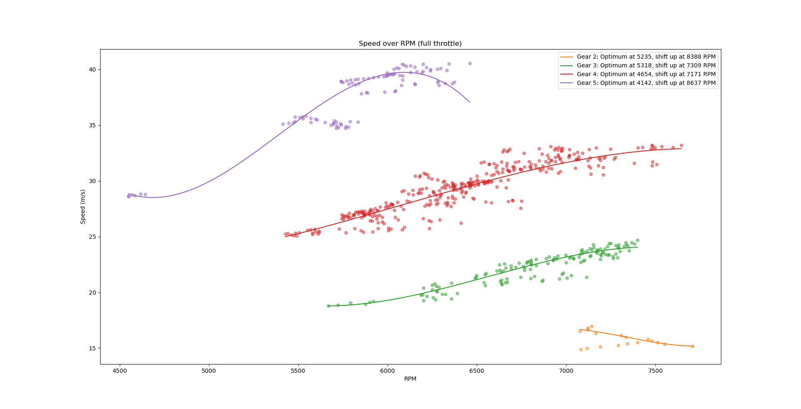
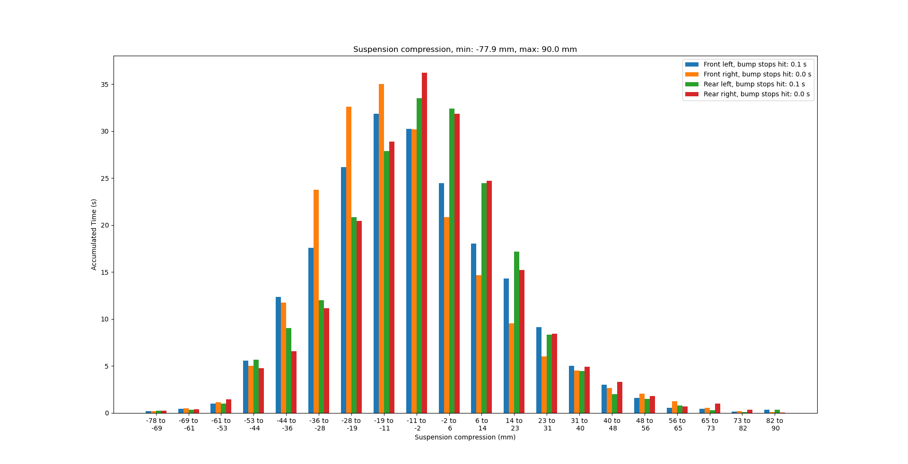
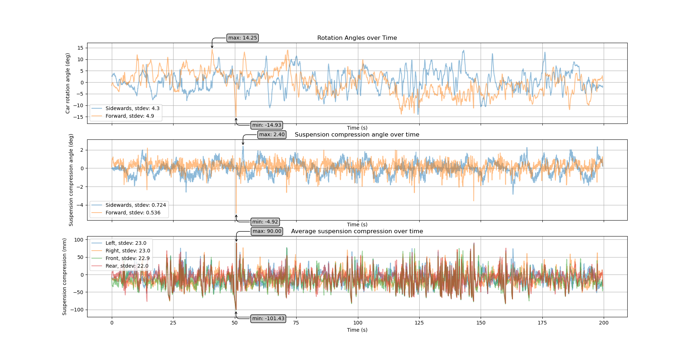
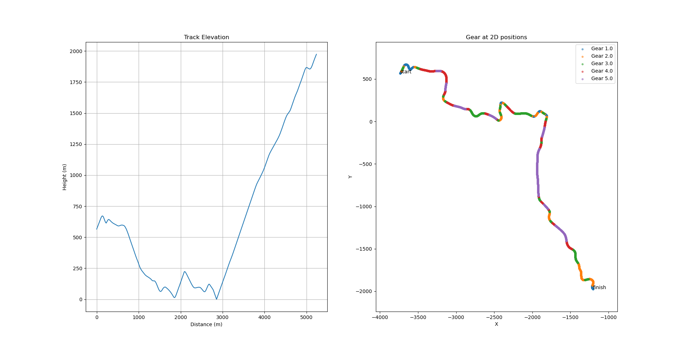
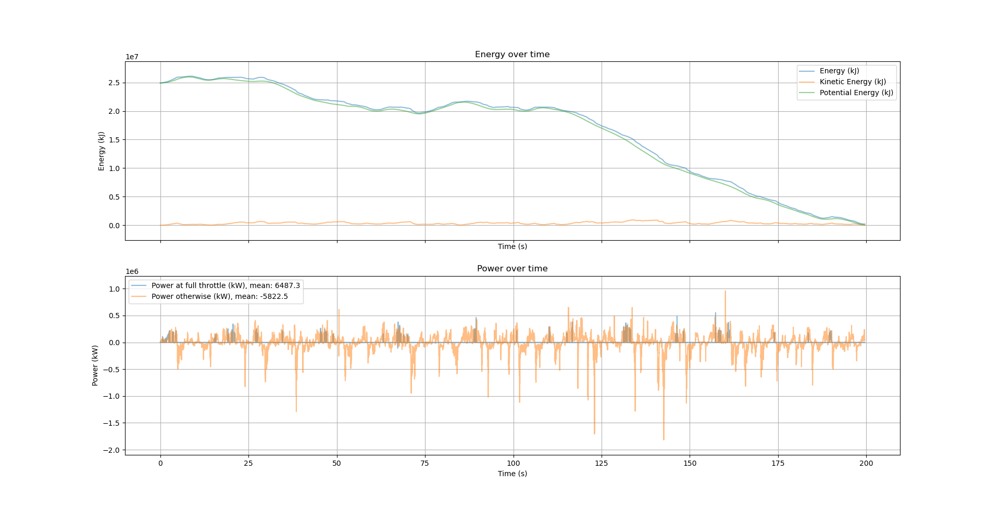
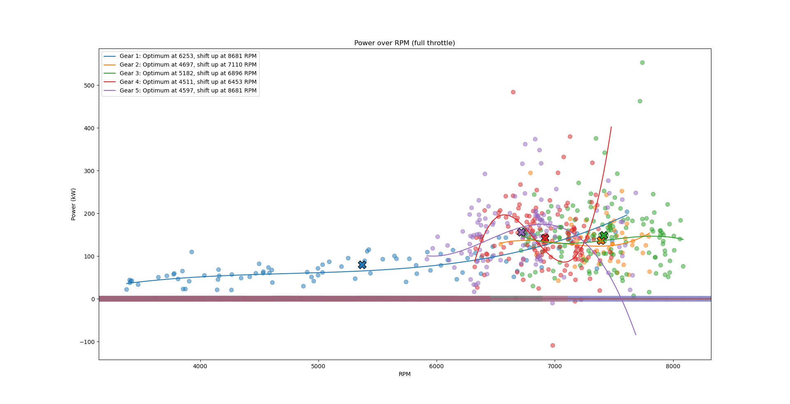
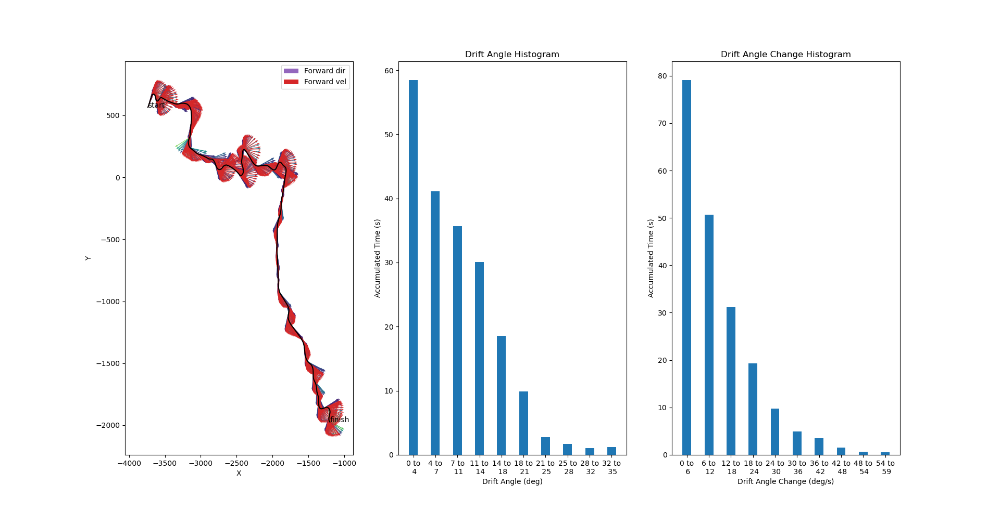
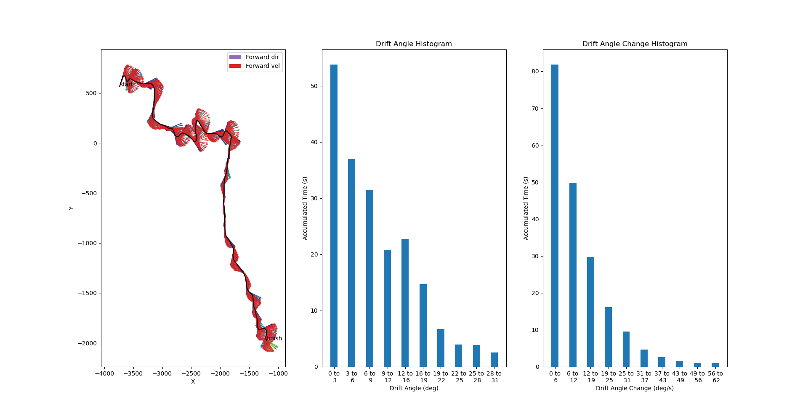

# Dirt Rally 2.0 Logger #

Dirt Rally 2.0 Logger is a logging and analysis tool for car setups in [Dirt Rally 1 and 2 by Codemasters](https://dirtrally2.com/). 
This is a free and open-source software written by Philipp Erler.

- [Executable (Version 1.8.1, 2020-05-15)](https://philipperler.net/dr2_logger_1_8_1/)
- [Source Code, Documentation and Support](https://github.com/ErlerPhilipp/dr2_logger)


## How to Use ##

1. Enable UDP data for Dirt Rally 1 and 2:
    1. Open the hardware_settings_config.xml:
        1. Windows (DR 1): "C:\Users\[USERNAME]\Documents\My Games\DiRT Rally\hardwaresettings\hardware_settings_config.xml"
        1. Windows (DR 2): "C:\Users\[USERNAME]\Documents\My Games\DiRT Rally 2.0\hardwaresettings\hardware_settings_config.xml"
        1. Linux (DR 1): "~/.local/share/feral-interactive/DiRT Rally/VFS/User/AppData/Roaming/My Games/DiRT Rally/hardwaresettings/hardware_settings_config.xml"
        1. Linux (DR 2 via Proton): "~/.local/share/Steam/steamapps/compatdata/690790/pfx/drive_c/users/steamuser/My Documents/My Games/DiRT Rally 2.0/hardwaresettings/hardware_settings_config.xml"
    1. Set udp enabled="true".
    1. Set extra_data=3 to get all information.
    1. Set ip="127.0.0.1" to keep the data on the machine running Dirt Rally.
    1. Set port=20777 (or change the port in the logger).
    1. Set delay="1" so that Dirt Rally sends the current car state at 100 FPS (maximum temporal resolution).
    1. You can add the 'custom_udp' line multiple times for multiple telemetry tools.
    1. Example:
        ```xml
        <motion_platform>
            <dbox enabled="false" />
            <udp enabled="True" extradata="3" ip="127.0.0.1" port="20777" delay="1" />
            <custom_udp enabled="false" filename="packet_data.xml" ip="127.0.0.1" port="20777" delay="1" />
            <custom_udp enabled="false" filename="packet_data.xml" ip="127.0.0.1" port="10001" delay="1" />
            <fanatec enabled="false" pedalVibrationScale="1.0" wheelVibrationScale="1.0" ledTrueForGearsFalseForSpeed="true" />
        </motion_platform>
        ```
1. Download and unzip the drlogger.zip archive.
1. Run the drlogger.exe while you play Dirt Rally.
1. The logger is set to Dirt Rally 2.0 mode by default. To switch to Dirt Rally 1 enter 'g Dirt_Rally_1' when the logger runs.
1. After each race, the logger will automatically save the current data.
1. At the start of a race, the logger will delete the old data.
1. Switch (Alt+Tab) from Dirt Rally to the logger to create the plots.
1. Remarks:
    1. You can edit the settings.ini to change the path for automatic session saves, the ip and port.
    1. Don't save, load or analyze your run while the race is running. Otherwise, data might get lost. Pausing the race is ok.
    1. This tool will probably work with other racing games by Codemaster, for example Dirt 4 and F1. Those games use the same datastructure for the UDP packages. However, I didn't test it. Other racing games with UDP output, such as Project Cars, will require some changes.


You should see a command-line window as shown above explaining all available commands. You can also see a progress bar during races and messages from commands.


## How to Analyze a Setup ##

Here is how to use this tool to analyze your car setups. This is an example with the Renault 5 Turbo (H3 RWD class) on Noorinbee Ridge Descent, Australia (dry, no events, optimal surface degradation). I chose this pretty crazy combination of a bitchy car on a fast and bumpy track to check the influence of the setup with minimal influence of skill. For reliable comparisons, I tried to get to the finish line as quickly as possible without major mistakes. After several attempts I managed to finish at 202.5 seconds with the default setup, which gave me the 41st place in the leaderboard. Improving only the gear setup gave me 202.2 seconds after only few attempts. With all setup changes, I managed to improve my time to 199.6 seconds, which was place 16! Here, I present the plots that helped me tune the setup, with some comments.


### Improved Setup ###

This is the improved setup for my experiment with the Renault 5 Turbo on Noorinbee Ridge Descent, Australia. All unmentioned options are at default values.
1. Alignment:
    1. (Front) Camber Angle = -1.20°
    1. (Rear) Camber Angle = -1.00°
1. Gearing:
    1. 1st Gear = 0.475
    1. 2nd Gear = 0.576
    1. 3rd Gear = 0.692
    1. 4th Gear = 0.822
    1. 5th Gear = 0.976
    1. Final Drive = 0.223 (minimum)
1. Damping: All = -2.00
1. Springs:
    1. (Front) Ride Height = 10.00 mm
    1. (Front) Spring Rate = 48.47 N/mm
    1. (Front) Anti-Roll Bar = 13.50 N/mm
    1. (Rear) Ride Height = 10.00 mm
    1. (Rear) Spring Rate = 59.15 N/mm
    1. (Rear) Anti-Roll Bar = 6.00 N/mm


### Gear Utilization ###

Default:


Improved:


This plot shows how much time you spent in which gear at which RPM. The predicted optimal RPM range is highlighted in green. 

In the default setup, the first gear was only used at the start and therefore pretty useless. I used the other gears very differently: I used the third and fourth much more than the second gear and fifth gears. This depends on my manual shifting, of course. I tried to shift at the optimal RPM or at least before the RPM meter turns red.

In my improved setup, I used the gears much more equally. The first gear is a bit special because I tuned it so that I can use it through the sharpest corners. I spent significantly more time in the optimal RPM range and much less time far away from the optimal RPM.

A note on my data analysis: There can be too much shifting as each shift costs around 0.1 s where the engine can't transfer power to the wheels. That's if you use modern cars. Older cars have much longer times.


### Speed over RPM ###

Default:


Improved:


This plot shows the speed at varying RPM. The predicted optimal RPM value is marked with a green bar. The mean values of the gear samples are marked as crosses. The lines are polynomials of degree 3 fitted into the samples. The optimal RPM is the median of their derivatives' maxima.

You can again see that I didn't use the first gear after the start anymore with the default setup. Also, the gears couldn't take profit of the full RPM range for all gears. I could not use the 1st and 5th gear in the optimal RPM range. The other gears span the optimal RPM range but overlap to some degree. The improved setup is much more regular and more centered around the optimal RPM.


### Suspension ###

Default:


Improved:


This plot shows the suspension compression of individual wheels. It looks like the default setup is already good because the bump stops are hardly ever touched. The optimal setting probably would be when the full range of the suspension is used without touching the bump stops. This should maximize the ground contact.

The front springs are less compressed although the rear springs are stiffer. The reason may be that the stiffer springs still can't counteract the weight of the engine in the rear. The difference between left and right wheels is due to the track with its camber and slanted jumps. My final setup distributes the dislocation a bit more broadly (note the different y-scale) without notably changing the bump stop times. The front-rear distribution is still unequal, which leaves some space for improvement.

A note on bump-stops: Because DR2 doesn't transmit the extension limits, we can only assume that the bump stops were hit when the same maximum and minimum values appear many times in the data.


### Ground Contact ###

Default:


Improved:


This plot shows the wheel-in-air detection, suspension dislocation and suspension velocity. With my improved setup the wheels where a bit shorter in the air, although I was faster and therefore jumping longer. The somewhat softer suspension and dampers mitigates the critical moments when the wheels are almost leaving the ground. I noticed that hard-to-control cars are behaving significantly better when I maximize the ground contact.

A note on ground-contact estimation: DR2 doesn't explicitly offer this information. I assume wheels to be in the air when the springs extend continuously over a rather long time (> 0.1 seconds) where the dampers lead to a decrease in extension speed. This means that the springs' compression speed is negative with a low variance. Low-friction situations can't be detected with this heuristic.


### Rotation vs Suspension ###

Default:


Improved:


This plot compares spring dislocation with car roll and pitch. With a good suspension, the car should be less affected by surface irregularities. However, when the terrain is too rough, e.g. with camber, the car must roll to the side. Similarly, driving over bumps shouldn't throw the car around but slopes and jumps of course rotate the car around its pitch axis.

The car rotations have much lower frequencies than the suspension angles, as it should be. With the improved setup, the body rotation is reduced a lot, which improves stability and control. As shown with the increased variance, the suspension absorbs more bumps now than with the default setup.

A note on suspension roll and pitch: The suspension angles are approximated for the width and length of the Audi Quattro S1. Therefore, the absolute values of the suspension rotation graph will be off for other cars. Either way, the relation between both graphs is still relevant.


### Bonus: Track Information ###

Default:


Improved:


This plot gives some basic information about the track such as elevation, route and used gear at each position.


### Bonus: Energy and Power ###

Default:


Improved:


This plot shows your car's kinetic and potential energy over time. It also shows the derived power output of the engine. The power output is only the change of kinetic velocity and therefore an approximation.


### Bonus: Power over RPM ###

Default:


Improved:


This plot shows the power output (change of kinetic energy) of your car depending on the RPM. In the improved setup, you can see clusters that are more centered around the predicted optimal RPM value.


### Bonus: Acceleration over RPM ###

Default:


Improved:


This plot shows the forward acceleration over RPM. The mean values of the gear samples are marked as crosses. The lines are polynomials of degree 3 fitted into the samples.

In the default setup, you can see rather distinct clusters for the gears, and the polynomials are quite irregular, which indicates that the gears are tuned unequally. In the optimized setup, the clusters are mostly overlapping, and the maxima are almost at the same RPM value, which is assumed to be the optimum.


### Bonus: Drift Angles ###

Default:


Improved:


In this plot, you can see the forward direction of the car and its movement direction. The more these vectors disagree, the more your car is drifting. The histogram in the middle shows how often you drifted and how much. The right histogram shows how fast the drift angle changed. With the improved setup, I drifted overall with a smaller angle but with faster changes of the drift angles. That is an additional hint that I had better control over my cars.


### Bonus: Wheel Speeds and Differential ###

Default:


Improved:


This plot shows the wheel speeds. The top graph is about individual wheels while the bottom graph shows the inputs (throttle, brakes and steering). Make sure to use the magnifying glass to zoom into the plots. The powered wheels are usually faster than the non-powered wheels. Downward spikes indicate that wheels are blocking when braking while upward spikes indicate freely spinning wheels caused by a lack of grip. The improved setup creates smaller spikes or at least symmetric ones.


## Raw Data ##

I can only use the information I get from Dirt Rally 1 and 2 via UDP. This is currently:

1. Run time (starts after loading screen)
1. Lap time (starts after countdown)
1. Distance (driven distance)
1. Progress (0.0..1.0)
1. Car position (3D vector in world space)
1. Forward speed (m/s as shown in HUD)
1. Car velocity (3D vector in world space)
1. Roll (3D vector in world space)
1. Pitch (3D vector in world space)
1. Suspension dislocation per wheel (mm)
1. Suspension dislocation change per wheel (mm/s)
1. Wheel speed per wheel (m/s)
1. Throttle (0.0..1.0)
1. Steering (-1.0..+1.0)
1. Brakes (0.0..1.0)
1. Clutch (0.0..1.0)
1. Gear (-1,0,1..n)
1. G-force (lat-lon)
1. Current lap
1. RPM of engine
1. Brake temperature
1. Laps
1. Track length
1. Max / idle RPM
1. Max gears

See [networking.py](source/networking.py) for more information.


## Run and Build ##

To run the logger as a Windows executable, simply download the latest release, unzip and double click the .cmd file.

To run the logger as a Python script, run these commands:
~~~~
# install [Anaconda with Python 3](https://anaconda.org/)
# open your repos directory in a terminal

# clone repo ./dr2_logger
git clone https://github.com/ErlerPhilipp/dr2_logger.git

# go into the cloned logger dir
cd dr2_logger

# create a conda environment with the required packages
conda env create --file dr2_logger.yml

# activate the new conda environment
conda activate dr2_logger

# run the logger with Python
python dr2_logger.py
~~~~

To build an executable, run \
`pyinstaller dr2_logger.py`


## Open Issues and Contributing ##

Please, feel free to open issues and send pull requests when you have ideas for improvements.

On the long run, comparing two or more recordings would be great. However, this is not easy because most plots would need a common registration. Using the run time won't work and using the progress would make time-dependent data hard to understand.

You may see 'unknown car' or 'unknown track' in your logs. This happens when the internal database is outdated. In this case, please fill in the car names in the 'unknown cars.txt' and 'unknown tracks.txt' that you should find in the logger's directory. Then send the contents of those files to me.
Due to ambiguous data (exactly the same idle/max RPM and number of gears), the following cars in DR2 cannot be distinguished:
- Lancia Delta S4 RX, non-RX and Peugeot 208 R2
- Peugeot 205 T16 RX and non-RX
- Audi S1 EKS RX Quattro Supercars (2019) and Volkswagen Polo R Supercar
- Peugeot 208 WRX Supercars (2019) and Renault Clio R.S. RX
- Renault Megane R.S. RX (2019) and Subaru Impreza WRX STI NR4 and Fiat 131 Abarth Rally 
- Ford Fiesta RXS Evo 5 and Ford Fiesta RX (Stard)
- Ford Focus RS Rally 2001 and Seat Ibiza RX
- Mitsubishi Lancer Evo VI and BMW M2 Competition
- Mitsubishi Lancer Evo X and Peugeot 208 T16
- Skoda Fabia Rally and Subaru WRX STI RX
- Skoda Fabia R5 and Volkswagen Polo GTI R5


## License ##

All parts of this project are published under the permissive [MIT license](./LICENSE). In short, you can do with the code, documentation, images and etc. on whatever you want. I hold no responsibility if it doesn't work as expected.

When you share (parts of) this repository, please mention or link my work. If you find this tool useful, I encourage you to leave some feedback, e.g. as an issue.


## Change Log ##

- 1.8.1 (2020-05-15):
    - Prevent several crashes and other bugfixes.
    - Add country code and region to track names.
    - Improved optimal RPM detection.
    - Improved wheel-in-air detection.
- 1.8 (2020-05-11):
    - Added support for Dirt Rally 1.
    - Mayor re-structuring to allow for different games in one logger.
    - Added setting for the target game, switch via command 'g Dirt_Rally_1'.
    - Many improvements for plots.
    - Added estimation of optimum RPM.
    - Improved ground-contact detection.
- 1.7 (2020-03-25):
    - Added cars and tracks for the Flat Out Pack.
    - Added (experimental) ground-contact detection.
    - Added (experimental) energy and power plots.
    - Simplified game-state detection.
- 1.6 (2019-10-14):
    - Added automatic car and track detection.
    - Improved automatic race detection.
- 1.5 (2019-10-01): 
    - Improved the automatic detection of races.
    - Input and output IPs and ports can now be changed in the 'settings.ini'.
    - You can now change the path for automatic session saves.
    - The logger can now forward received UDP packages to another socket. This way, you can use the logger and telemetry tools at the same time.
- 1.4 (2019-09-07): 
    - Added automatic detection and saving of runs.
    - Prevent a crash caused by not enough data for plots.
- 1.3 (2019-09-02): 
    - Keyboard I/O is now in a separate thread.
    - The current state is now printed in the window title.
- 1.2 (2019-08-25): 
    - Improved histograms.
    - Added error handling for sockets.
- 1.1 (2019-08-19): Improved plots for suspension and rot vs susp.
- 1.0 (2019-08-17): Initial release.


## Older Releases ##

- [Executable (Version 1.8, 2020-05-11)](https://philipperler.net/dr2_logger_1_8/)
- [Executable (Version 1.7, 2020-03-25)](https://philipperler.net/dr2logger_1_7/)
- [Executable (Version 1.6, 2019-10-14)](https://philipperler.net/dr2logger_1_6/)
- [Executable (Version 1.5, 2019-10-01)](https://philipperler.net/dr2logger_1_5/)
- [Executable (Version 1.4, 2019-09-14)](https://philipperler.net/dr2logger_1_4/)
- [Executable (Version 1.3, 2019-09-02)](https://philipperler.net/dr2logger_1_3/)
- [Executable (Version 1.2, 2019-08-25)](https://philipperler.net/dr2logger_1_2/)
- [Executable (Version 1.1, 2019-08-19)](https://philipperler.net/dr2logger_1_1/)
- [Executable (Version 1.0, 2019-08-17)](https://philipperler.net/dr2logger_1_0/)


## Related Tools ##

Aside from this tool, which focuses on the analysis and visualization of single runs, there are other tools.

[Dirt Rally Time Recorder](https://github.com/soong-construction/dirt-rally-time-recorder):
This tool allows you to track your stage times in DiRT Rally and browse them, which the game itself does not allow.

[RaceTrack Data Acquisition](https://www.racedepartment.com/downloads/racetrack-data-acquisition-rda.26829/):
RDA is an application that can log telemetry from DiRT Rally and DiRT Rally 2.0 to CSV, BIN, or MoTeC LD files.
It includes an overlay window with delta times.

