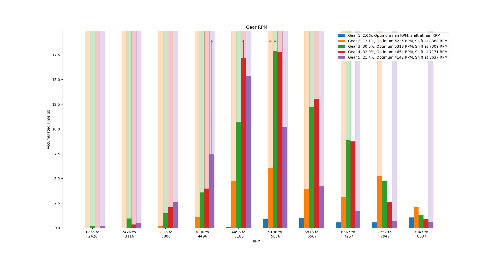
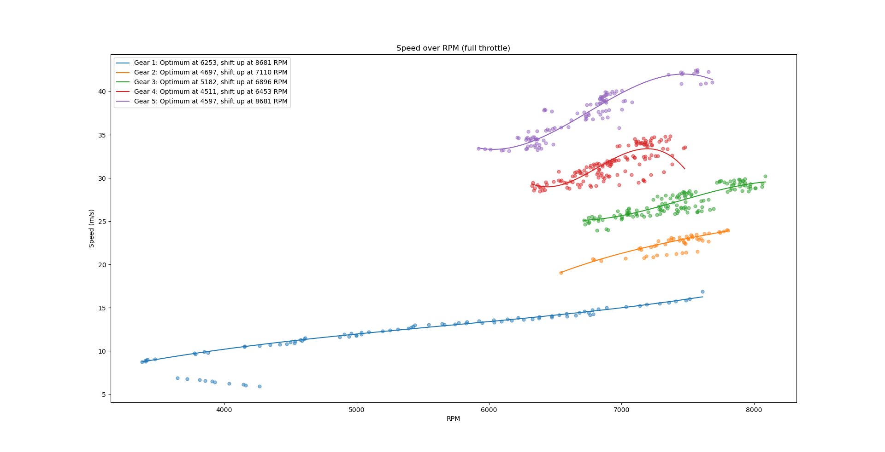
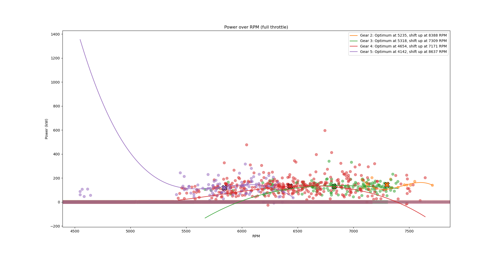
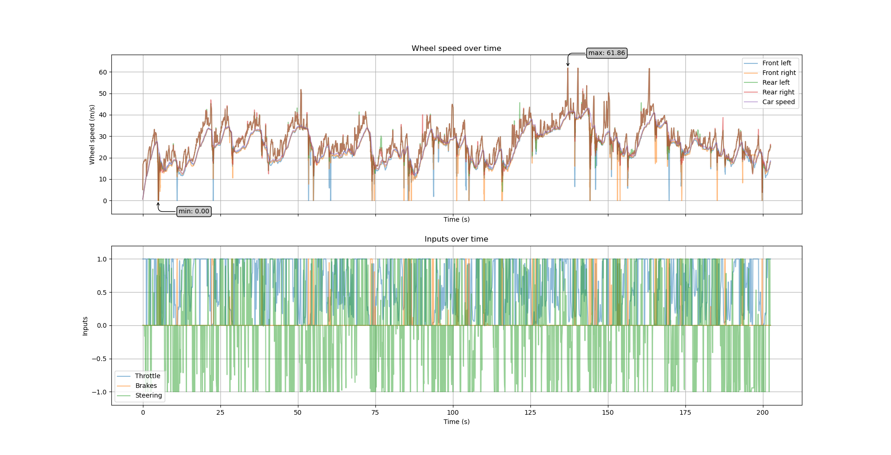

# Example Usage #

Here is how I used the logger to optimize the setups for the Renault 5 Turbo (H3 RWD class) on Noorinbee Ridge Descent, Australia (dry, no events, optimal surface degradation). I chose this pretty crazy combination of a bitchy car on a fast and bumpy track to check the influence of the setup with minimal influence of skill and practice. For reliable comparisons, I tried to get to the finish line as quickly as possible without crashes. Basically, if I get through, it's fast. After several attempts I managed to finish at 202.5 seconds with the default setup, which gave me the 41st place in the leaderboard. Improving only the gear setup gave me 202.2 seconds after only few attempts. With all setup changes, I managed to improve my time to 199.6 seconds, which was place 16! Here, I present the plots that helped me tune the setup, with some comments.

[If you don't know the plots, read this description first.](plots_description.md)

## Improved Setup ##

This is the improved setup for my experiment with the Renault 5 Turbo on Noorinbee Ridge Descent, Australia. All unmentioned options are at default values.
1. Alignment:
    1. (Front) Camber Angle = -1.20°
    1. (Rear) Camber Angle = -1.00°
1. Gearing:
    1. 1st Gear = 0.475
    1. 2nd Gear = 0.576
    1. 3rd Gear = 0.692
    1. 4th Gear = 0.822
    1. 5th Gear = 0.976
    1. Final Drive = 0.223 (minimum)
1. Damping: All = -2.00
1. Springs:
    1. (Front) Ride Height = 10.00 mm
    1. (Front) Spring Rate = 48.47 N/mm
    1. (Front) Anti-Roll Bar = 13.50 N/mm
    1. (Rear) Ride Height = 10.00 mm
    1. (Rear) Spring Rate = 59.15 N/mm
    1. (Rear) Anti-Roll Bar = 6.00 N/mm

## Gear Utilization ##

Default:

Improved:

In the default setup, the first gear was only used at the start and therefore pretty useless. I used the other gears very differently: I used the third and fourth much more than the second gear and fifth gears. This depends on my manual shifting, of course. I tried to shift at the optimal RPM or at least before the RPM meter turns red.

In my improved setup, I used the gears much more equally. The first gear is a bit special because I tuned it so that I can use it through the sharpest corners, which is still less than the other gears. I spent significantly more time near the optimal RPM range.

## Speed over RPM ##

Default:

Improved:

With the default setup, you can see again that I didn't use the first gear after the start anymore and it didn't cover the optimal RPM range. Also, I couldn't use the 5th gear in the optimal RPM range because I couldn't reach the necessary speed. The other gears span the optimal RPM range but overlap to some degree. The improved setup is much more regular and more centered around the optimal RPM.

## Suspension ##

Default:

Improved:

The default setup is already looks quite good because the bump stops are hardly ever touched. The optimal setting is probably when the full range of the suspension is used without touching the bump stops. This should maximize the ground contact.

The front springs are less compressed although the rear springs are stiffer. The reason may be that the stiffer springs still can't counteract the weight of the engine in the rear. The difference between left and right wheels is due to the track with its camber and slanted jumps. My final setup distributes the dislocation a bit more broadly (note the different y-scale) without notably changing the bump stop times. The front-rear distribution is still unequal, which leaves some space for improvement.

## Ground Contact ##

Default:

Improved:

With my improved setup the wheels were a bit shorter in the air, although I was faster and therefore jumped longer. The somewhat softer suspension and dampers mitigates the critical moments when the wheels are almost leaving the ground. I noticed that hard-to-control cars are behaving significantly better when I maximize the ground contact.

## Rotation vs Suspension ##

Default:

Improved:

The car rotations have much lower frequencies than the suspension angles, as it should probably be. With the improved setup, the body rotation is reduced a lot, which improves stability and control. As shown with the increased variance, the suspension absorbs more bumps now than with the default setup.

## Bonus: Power over RPM ##

Default:

Improved:

In the improved setup, you can see clusters that are more centered around the predicted optimal RPM value.

## Bonus: Acceleration over RPM ##

Default:

Improved:

In the default setup, you can see rather distinct clusters for the gears, and the polynomials are quite irregular, which indicates that the gears are tuned unequally. In the optimized setup, the clusters are mostly overlapping, and the maxima are almost at the same RPM value, which is assumed to be the optimum.

## Bonus: Drift Angles ##

Default:

Improved:

With the improved setup, I drifted overall with a smaller angle but with faster changes of the drift angles. That is an additional hint that I had better control over my cars.

## Bonus: Wheel Speeds and Differential ##

Default:

Improved:

The improved setup creates smaller spikes or at least symmetric ones.

## Further Information ##

[See a description of the plots here.](plots_description.md)

[Have a look at some general guidelines for tuning and a if...then list.](tuning_guide.md)

