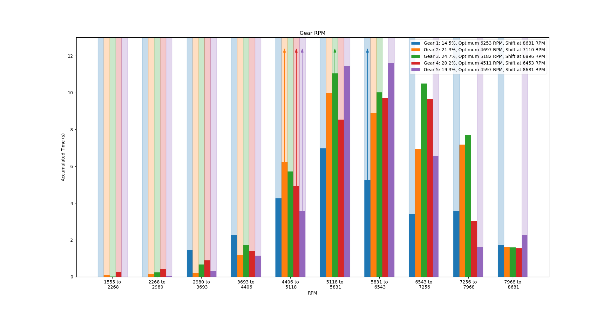
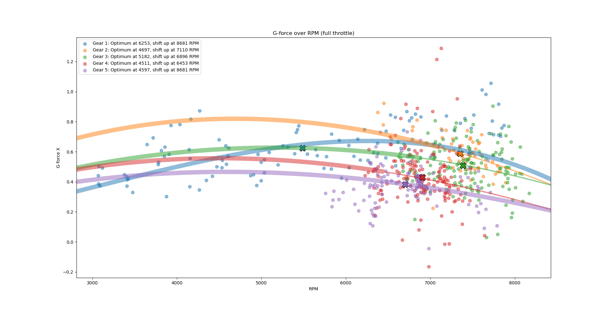
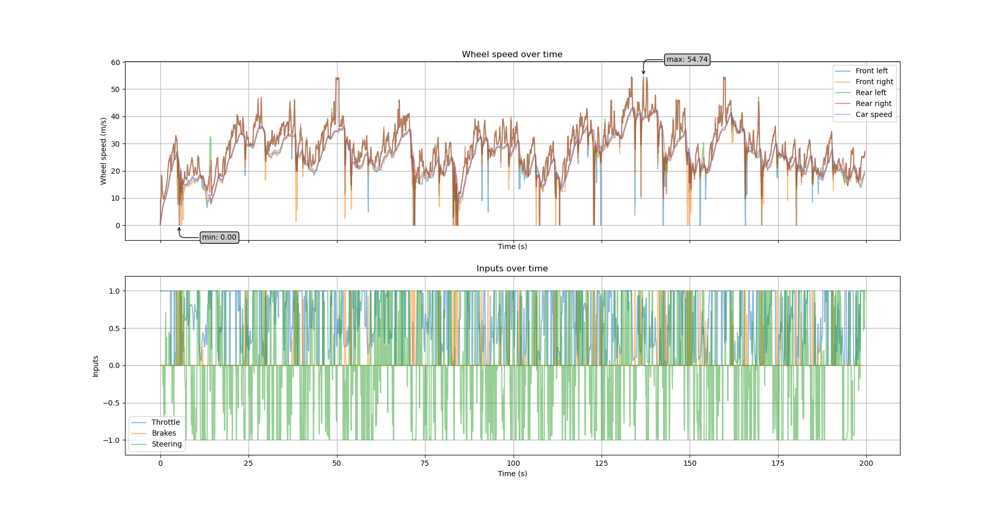

# Plot Description #

This document describes the plots available in the logger.

## Gear Utilization ##

This plot shows how much time you spent in which gear at which RPM. The predicted optimal RPM range is highlighted in green.

A note on my data analysis: There can be too much shifting as each shift costs around 0.1 s where the engine can't transfer power to the wheels. That's if you use modern cars. Older cars have longer times.

## Speed over RPM ##

This plot shows the speed at varying RPM. The predicted optimal RPM value is marked with a green bar. The mean values of the gear samples are marked as crosses. The lines are polynomials of degree 3 fitted into the samples. The optimal RPM is the median of their derivatives' maxima location.

## Suspension ##

This plot shows the suspension compression of individual wheels as histogram. 

A note on bump-stop estimation: Because DR2 doesn't transmit the extension limits, we can only assume that the bump stops were hit when the same maximum and minimum values appear many times in the data.

## Ground Contact ##

This plot shows the wheel-in-air detection, suspension dislocation and suspension velocity. 

A note on ground-contact estimation: DR2 doesn't explicitly offer this information. I assume wheels to be in the air when the springs extend continuously over a rather long time (> 0.1 seconds) where the dampers lead to a decrease in extension speed. This means that the springs' compression speed is negative with a low variance. Most low-friction situations can't be detected with this heuristic. However, we can't detect if the car bottoms out with this method.

## Rotation vs Suspension ##

This plot compares spring dislocation with car roll and pitch. With a good suspension, the car should be less affected by surface irregularities. However, when the terrain is too rough, e.g. with camber, the car must roll to the side. Similarly, driving over bumps shouldn't throw the car around but slopes and jumps of course rotate the car around its pitch axis.

A note on suspension roll and pitch: The suspension angles are approximated for the width and length of the Audi Quattro S1. Therefore, the absolute values of the suspension rotation graph will be off for other cars. Either way, the relation between both graphs should still be relevant.

## Track Information ##

This plot gives some basic information about the track such as elevation, route and used gear at each position.

## Energy and Power ##

This plot shows your car's kinetic and potential energy over time. It also shows the derived power output of the engine. The power output is only the change of kinetic velocity and therefore an approximation.

### Power over RPM ###

This plot shows the power output (change of kinetic energy) of your car depending on the RPM. In the improved setup, you can see clusters that are more centered around the predicted optimal RPM value.

## Acceleration over RPM ##

This plot shows the forward acceleration over RPM. The mean values of the gear samples are marked as crosses. The lines are polynomials of degree 3 fitted into the samples.

## Drift Angles ##

In this plot, you can see the forward direction of the car and its movement direction. The more these vectors disagree, the more your car is drifting. The histogram in the middle shows how often you drifted and how much. The right histogram shows how fast the drift angle changed.

## Wheel Speeds and Differential ##

This plot shows the wheel speeds. The top graph is about individual wheels while the bottom graph shows the inputs (throttle, brakes and steering). The powered wheels are usually faster than the non-powered wheels. Downward spikes indicate that wheels are blocking when braking while upward spikes indicate freely spinning wheels caused by a lack of grip. 

## Further Information ##

[Here, I explain how I used the logger to optimize the setup of the Renault 5 Turbo for Noorinbee Ridge Descent, Australia.](example.md)

[Have a look at some general guidelines for tuning and a if...then list.](tuning_guide.md)
