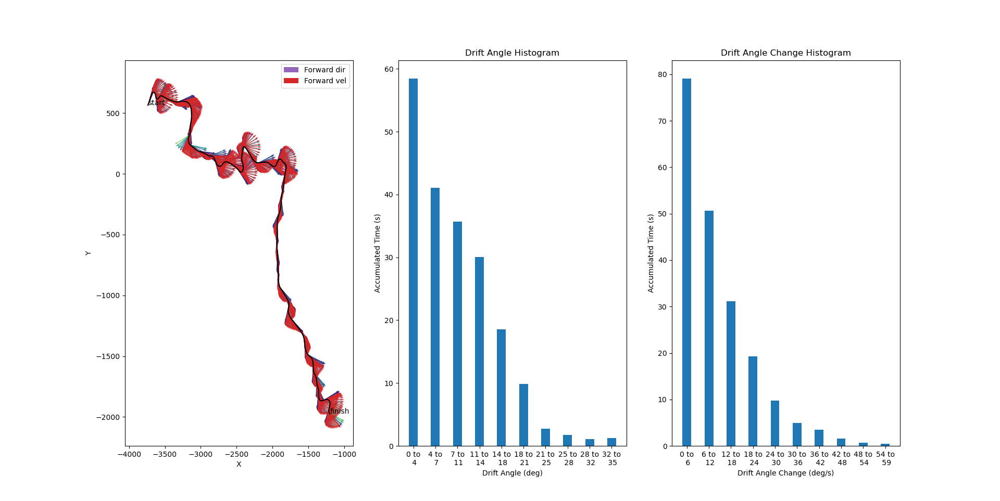
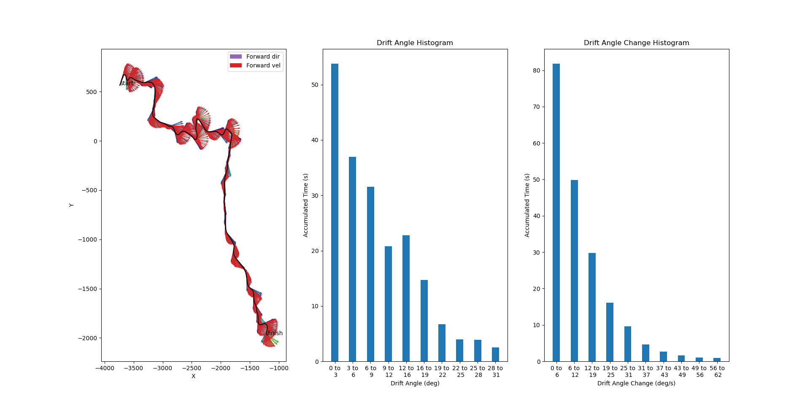
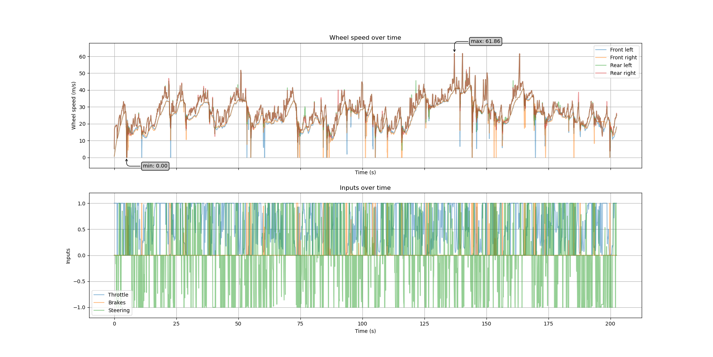
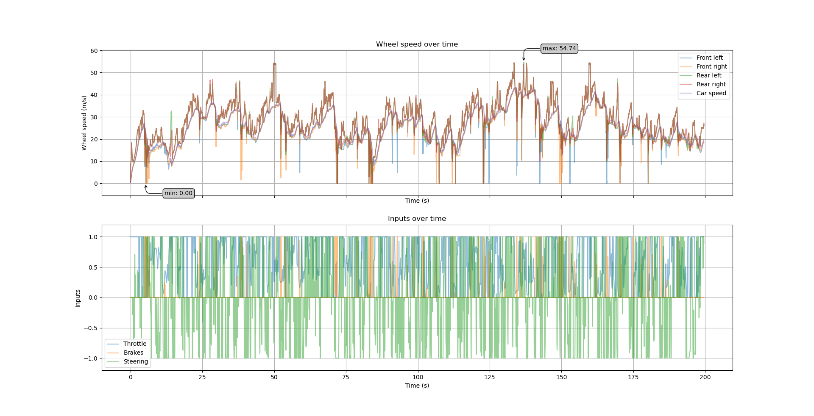
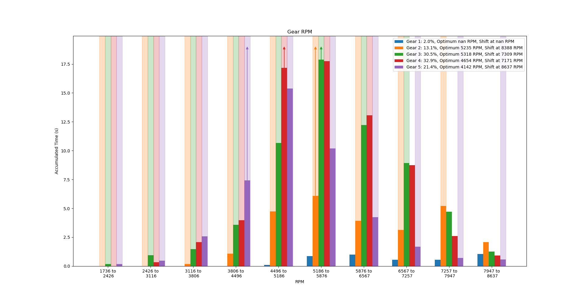
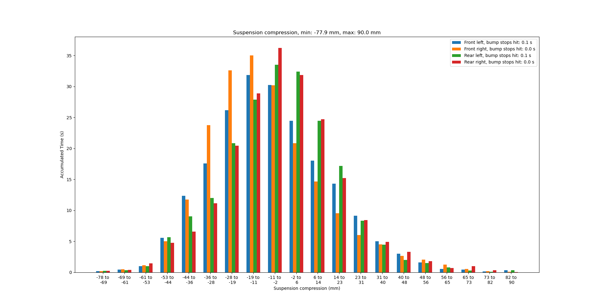
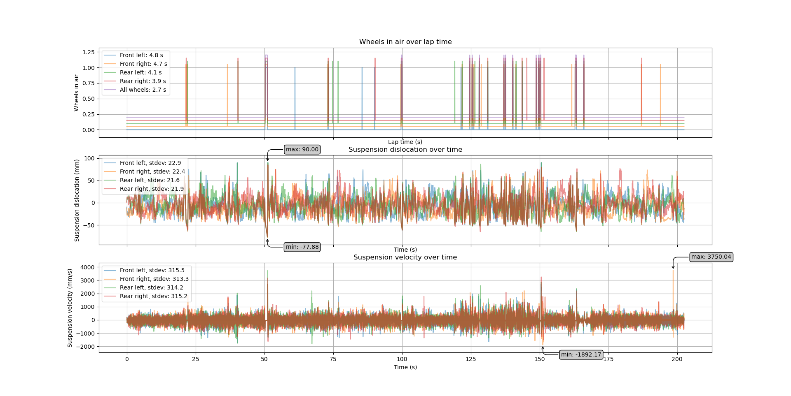
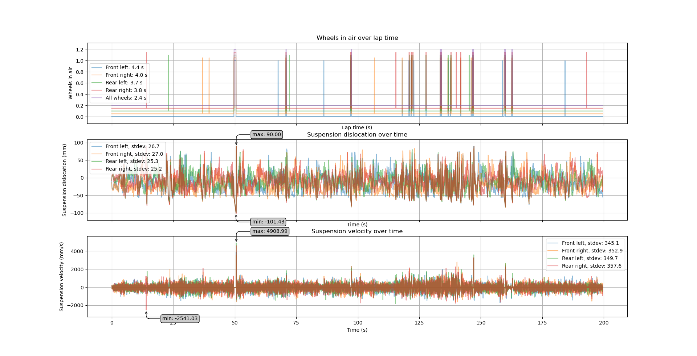
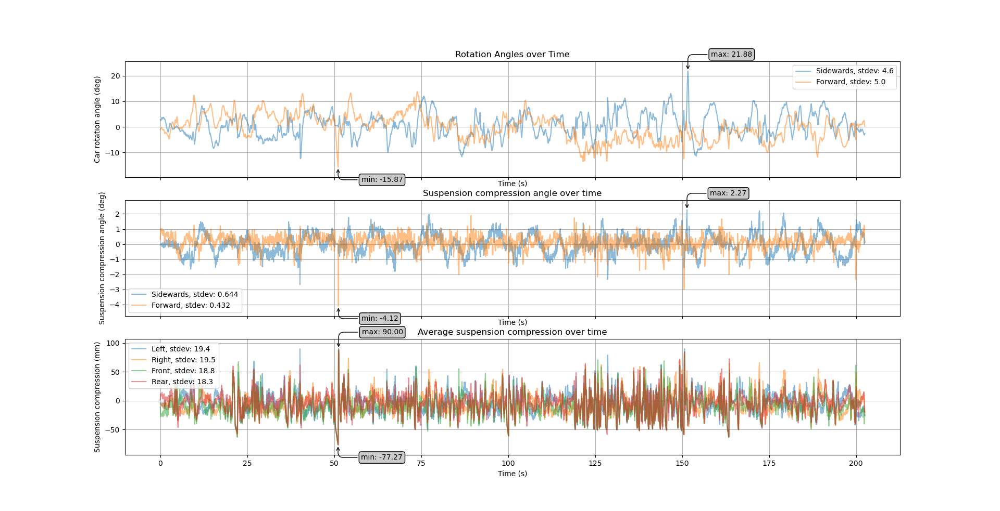
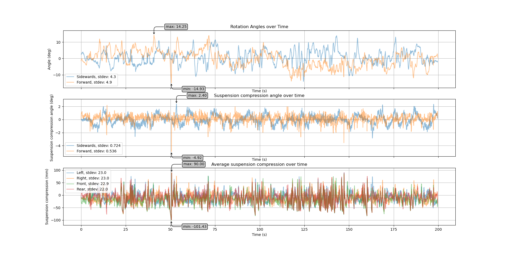

# Tuning Guidelines #

Disclaimer:
I'm an enthusiast but not an expert. I read some guides (see [References](tuning_guide.md/#references)) but those are also mostly made by non-experts. I have some basic knowledge about physics but not really about cars. Furthermore, I'm not a pro-driver in Dirt Rally. If you disagree with anything, please open an issue and discuss it.

This guide is aiming at Dirt Rally 2 but will also work with Dirt Rally 1 and at least partially with other Rally sims.

The setups are meant for driving without assists, i.e. without ABS and traction control.

## Contents ##

1. [TLDR](tuning_guide.md/#tldr)
1. [Cornering](tuning_guide.md/#cornering)
1. [Gearing](tuning_guide.md/#gearing)
1. [Suspension](tuning_guide.md/#suspension)

## TLDR ##

Cornering:
    - Camber:
        - Default settings are usually fine.
        - Try more negative camber in wet conditions and on fast, curvy tracks (typically tarmac).
        - Keep front and rear equal.
    - Toe:
        - Default settings are usually fine.
        - When you can't turn fast enough into hairpins, try more toe-out.
        - When the car doesn't move straight, try toe-in.
        - To get more oversteer, try more toe out at the rear.
    - Differential:
        - Front: Set as strong as possible without causing understeer.
        - Rear: Set as strong as possible without causing crashes (snap-oversteer).
        - Tarmac: Set loose enough so wheels don't slip in sharp corners.
        - Pre-Load: Set as loose as possible. Make stronger when sudden weight transfers cause instability.
        - Breaking lock: Default settings are usually fine.
    - Brakes:
        - Default settings are usually fine.
        - When you have too much oversteer, move the brake bias to the front.
        - If you want stronger breaks without changing the blocking behavior, try a stronger breaking differential.
- Gearing:
    - First Gear
        - Ignore the start, optimize for the sharpest corners.
        - Make short enough to keep the turbo under pressure.
        - Make long enough to prevent excessive traction loss when accelerating strongly.
    - Top Gear
        - Make as short as possible.
        - Make long enough to prevent red-lining on the fastest straights, unless these parts are negligible.
    - Middle Gears
        - If the track is flat, interpolate linearly between the first and the top gear.
        - If the track is mostly up-hill, stack the lower gears: shorter lower gears, longer higher gears and vice-versa.
    - Final Drive
        - Make as short as possible.
        - Make longer if you can't make the top gear long enough. Remember to update the other gears.
- Suspension:
    - Springs strength
        - Set softer on slow and bumpy tracks.
        - Set firmer when the car is unresponsive.
    - Height
        - Set as low as possible.
        - Set higher when the car bottoms out.
        - Tune together with spring strength.
    - Stabilizers (Anti-Roll Bar)
        - Set softer when you suffer from snap-oversteer.
        - Set firmer when the car is unresponsive.
    - Dampers
        - Set softer if you lose control on bumpy tracks.
        - Set firmer when the car swings too much or bottoms out.
        - Set fast bump a bit softer than slow bump and fast rebound a bit firmer than slow rebound.

## Cornering ##

What is good cornering, what bad? This seems rather subjective and is hard to measure. Still, these guidelines and some of the plots should help you.

### Camber ###

Negative camber means that the upper part of the wheel is closer to the car than the lower part. This can increase the grip in corners. However, too much camber decreases the traction significantly and with it the acceleration. Camber also has an effect on the transition between normal turning and drifting. Negative camber makes this transition smoother and therefore easier to control.

### Toe In/Out ###

Toe in means that the front of the wheels is pointed towards the car's middle line. More toe-out means that the car reacts faster to steering inputs. Toe-in tends to stabilize when accelerating, which can help with oversteering cars. Both directions increase drag and therefore decrease your maximum velocity.

### Differential ###

For loose surfaces, set the front differential as strong as possible. When you point the front wheels in the right direction, they will pull you where you want to go. This is my personal taste and probably works only in Dirt Rally. Extremely strong settings may cause understeer, though.
The rear differential on loose surfaces is similar but very strong settings may lead to snap-oversteer. That's especially important in hard-to-handle cars (e.g. Rally GT and H3 RWD).

For tarmac: Drive through the sharpest corner of the track without breaking and accelerating. If a wheel starts skidding, you lose traction or perhaps even experience a sudden over/under-steer, you should loosen the differential. However, be careful with this experiment because such bad cornering can also be caused by bad suspension setting.

Pre-load is a rather abstract setting. My experience is that a too strong setting is hard to notice but will affect your times. A too loose setting can be noticed sometimes when you lose control after sudden weight transfers caused e.g. by jumps and strong breaking.

Breaking lock: When you want to decelerate more quickly but don't want to change the break strength to preserve the wheel locking, you can try to strengthen the breaking lock. Note that the weight transfer will be stronger, which can lead to understeer.

### Brakes ###

First, blocked wheels are not necessarily a bad thing. On gravel, they will assemble a tiny dirt heap in front of the wheels that decelerates you more quickly. On tarmac, however, blocked wheels will have less traction and therefore decelerate worse. Also, skidding destroys the tyres' profile very quickly.  

Bias: When you try to turn into a corner with blocked wheels, you will experience extremely strong understeer. Therefore, you need to release the break and maybe even accelerate through the corner. The break bias determines which wheels block first. Usually, all wheels should block at the same time. However, this is also influenced by the track's slope and the weight transfer. When you lose control while breaking, you should move the bias to the front. Too much front bias will cause understeer and can reduce the deceleration.

Break strength: While it's simple on the first sight - set breaks stronger to decelerate stronger - it also affects the weight transfer and wheel blocking. Stronger breaks block the wheels more quickly, of course. This can make the car very sensitive to inputs and may cause dangerous understeer, especially on tarmac. If racing on loose surfaces and you can't block the wheels, you should increase the break strength.

### Helpful Plots ###

#### Drift Angles ####

Default:

Improved:

With the improved setup, I drifted overall with a smaller angle but with faster changes of the drift angles. That is a hint that I had more control over my cars.

#### Wheel Speeds and Differential ####

Default:

Improved:

The improved setup creates smaller spikes or at least symmetric ones.

## Gearing ##

As a basic guideline, I stick with the advice from [GTR Technical](https://www.youtube.com/channel/UCQ05BZF9F6q2xKyV6viCBGg): "A lower final drive aims towards better acceleration. Where as a higher final drive aims towards top speed. Seen as rally cars very rarely achieve top speed I focus my setups heavily towards acceleration only increasing the final drive as and when I start redlining in top gear."

When trying the default setups in DR2, I often notice that I use the first gear only at the start and the top gear not at all. This is clearly not optimal.

### First Gear ###

The optimizing the first gear, you can usually ignore the influence of the start. Instead, the sharpest corners of the track are much more important and might require significantly higher speed.

Still, you can use the start to check if the first gear is too short. If the engine is powerful, the wheels may spin uncontrolled with minimal traction. Make the first gear long enough to prevent excessive traction loss when accelerating strongly. Keep in mind that this will also be affected by the differential and tyre choice.

### Top Gear ###

The top gear determines your top speed. If the RPM reaches the red range, you should make it longer. Usually, acceleration is much more important than top speed, so don't overdo it.

### Middle Gears ###

I assume that using all gears equally is optimal, which means that linearly interpolating between the first and top gears is best. If you focus on left-foot breaking techniques, you might prefer using fewer gears.

Also remember that shifting takes a bit of time where the engine can't accelerate the car. So, there might be situations where less shifting and even skipping a gear might be better than tightly packed gears. 

For significant up-hill, you should concentrate the middle gears closer to the first gear and move them towards the top gear for down-hill.

### Final Drive ###

You should shorten the final drive in order to move the peaks to the right, towards the optimal RPM. To increase the time of the first gear, you should make it longer. Because this requires a larger change, you should also make the next gear longer.

### Helpful Plots ###

I assume that there is an optimal RPM point where the engine can output the most power. This RPM point is specific to every car and can change with the gear setup.

This [gear histogram](plots_description.md/#gear-utilization) shows a setup that breaks these assumptions. The first gear is hardly used and the second gear is used much less than the other gears. Also, the most used RPM ranges (peaks) of all gears are a bit off the optimal RPM point.

## Suspension ##

The suspension setup is essentially a trade-off between stability and responsiveness. You'll want to maximize the friction between the wheels and the track while preserving a fast response to steering inputs. These settings are very complicated and influence many properties. Please see the [guide by Tolga Yilmaz](https://steamcommunity.com/sharedfiles/filedetails/?id=2028926468) for more details and recommendations.

### Springs ###

Softer springs transfer less ground irregularities to the car body. However, firmer springs make the car more predictable and allow for a quicker steering response. Also note that softer springs cause more roll and weight transfer.

### Height ###

Softer springs cause more suspension travel. This means that you should also increase the height to avoid hitting the bump stops or the ground, e.g. after jumps.

### Stabilizers ###

Also known as anti-roll bars, stabilizers are meant to control the roll of the car. A too firm setting can cause the inside wheel (closer to the turn's center) to lose ground contact, which in turn can lead to snap-oversteer. You should use firm settings for fast tracks and soft settings for slow and curvy tracks. You should also set it softer on very bumpy tracks.

### Dampers ###

Dampers reduce the energy in the suspension over time. This means that stronger dampers reduce bouncing more quickly. If you notice that the springs oscillate multiple times after a jump, you should set them stronger. If you lose control on bumpy tracks, you should set them softer.

Furthermore, these settings control how fast the car reacts to corners and weight transfer. If you have issues at e.g. chicanes, try firmer dampers.

With good rebound settings, the wheels will will get ground contact quickly again after a crest. Too firm settings will keep the wheels in the air while too soft settings can push the car into the air. Rebound settings should be similar to bump settings.

Fast bump should be a bit softer than the slow settings to better absorb sudden strong hits from e.g. single stones. After the stones, the wheel should not instantly bounce back but stay a bit more stable. Therefore, fast rebound (if available) should be a bit firmer than slow rebound. The threshold for the fast settings is difficult to find, I simply use the default settings.

### Helpful Plots ###

#### Springs ####

The default setup already looks quite good because the bump stops are hardly ever touched. The optimal setting is probably when the full range of the suspension is used without touching the bump stops. This should maximize the ground contact.

The front springs are less compressed although the rear springs are stiffer. The reason may be that the stiffer springs still can't counteract the weight of the engine in the rear. The difference between left and right wheels is due to the track with its camber and slanted jumps. My final setup distributes the dislocation a bit more broadly (note the different y-scale) without notably changing the bump stop times. The front-rear distribution is still unequal, which leaves some space for improvement.

#### Ground Contact ####

Default:

Improved:

With my improved setup, the wheels were a bit shorter in the air, although I was faster and therefore jumped longer. The somewhat softer suspension and dampers mitigates the critical moments when the wheels are almost leaving the ground. I noticed that hard-to-control cars are behaving significantly better when I maximize the ground contact.

#### Rotation vs Suspension ####

Improved:

The car rotations have much lower frequencies than the suspension angles, as it should probably be. With the improved setup, the body rotation is reduced a lot, which improves stability and control. As shown with the increased variance, the suspension absorbs more bumps now than with the default setup.

If the car rotates more left-right than front-back, something is off. Either the stabilizers are much too strong or too soft, which causes the car to bottom out on a side. It may also happen that the track has a lot of extreme camber.

## References ##

I mostly described simplistic if ... then ... guidelines with little explanation. If you are interested in the technical details, have a look at these sources.

There are a ton of great setups shown in the YouTube channel [GTR Technical](https://www.youtube.com/channel/UCQ05BZF9F6q2xKyV6viCBGg).

[Paradigm Shift Racing](https://www.paradigmshiftracing.com/racing-basics/) has a lot of content for racing amateurs and professionals. We can use their knowledge for racing simulations, too. Their focus is on tarmac racing tracks, so we need to adapt some aspects for loose surfaces.
Two pages are especially interesting:
- [Glossary](https://www.paradigmshiftracing.com/racing-basics/racing-and-motorsports-terms-glossary#/)
- [Setup Guide](https://www.paradigmshiftracing.com/racing-basics/step-by-step-race-car-setup-guide#/)

[This guide for Forza Horizon 4 Rally](https://www.youtube.com/watch?v=5U2t_2yberY) and [this guide for WRC8](https://www.youtube.com/watch?v=Y6f4ar0IHwQ) are also applicable to Dirt Rally.

The Steam Community has several good guides to setups. [This guide for Dirt Rally 1](https://steamcommunity.com/sharedfiles/filedetails/?id=456484010) is well-written and detailed enough for most players. 
[This guide for Dirt Rally 2](https://steamcommunity.com/sharedfiles/filedetails/?id=2028926468) is even more extensive and provides extremely detailed background information. This one is the main reference for my guide.

## Further Information ##

[See a description of the plots here.](docs/plots_description.md)

[Here, I explain how I used the logger to optimize the setup of the Renault 5 Turbo for Noorinbee Ridge Descent, Australia.](docs/example.md)

